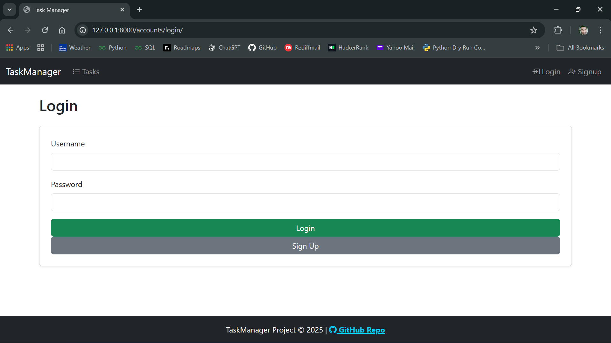
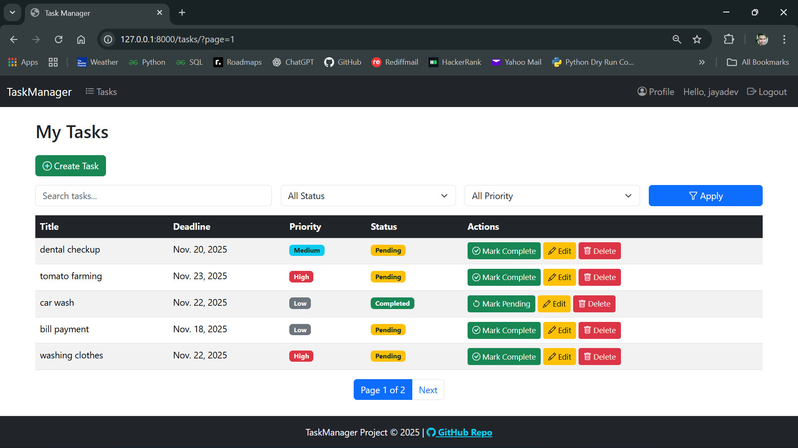
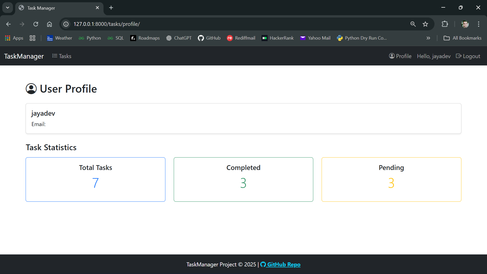

# 📝 TaskManager Project

## 📌 Objective
A Django-based web application to manage personal tasks with authentication, CRUD operations, filters, and analytics.  
This project demonstrates end-to-end web development skills: backend logic, database design, responsive UI, and deployment.

---

## 🚀 Features
- 🔐 User authentication (signup, login, logout)
- 📋 Task CRUD (create, update, delete)
- 🔍 Search and filter tasks by status, priority, or keyword
- 📅 Deadline highlighting (overdue tasks shown in red)
- ✅ Completion toggle (mark tasks as done/pending)
- 📑 Pagination for task lists
- 👤 Profile page with task statistics (total, completed, pending)
- 🎨 Responsive Bootstrap UI with global alerts and footer

---

## 🖼️ Screenshots
> Add screenshots here after testing and deployment.  
> Save them in a `screenshots/` folder in your repo and link them below.

### 🔐 Login Page


### 📋 Task List


### 👤 Profile Page


---

## ⚙️ Tech Stack
- **Backend**: Django (Python)
- **Database**: MySQL
- **Frontend**: Bootstrap 5 + Bootstrap Icons
- **Deployment**: Heroku / Render

---

## 📂 Project Setup

Clone the repository:
```bash
git clone https://github.com/jayen120/taskmanager.git
cd taskmanager
